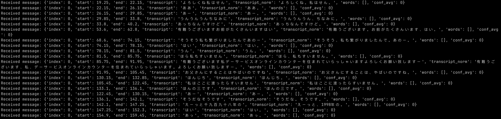

# Janpanese realtime transcription

## API

- URL: `wss://jppoc.namisense.ai/connect?sample_rate=16000`
- Query parameters: `sample_rate` (default 16000)

## Setup to run

```bash
pip install -r requirements.txt
python main.py
```

